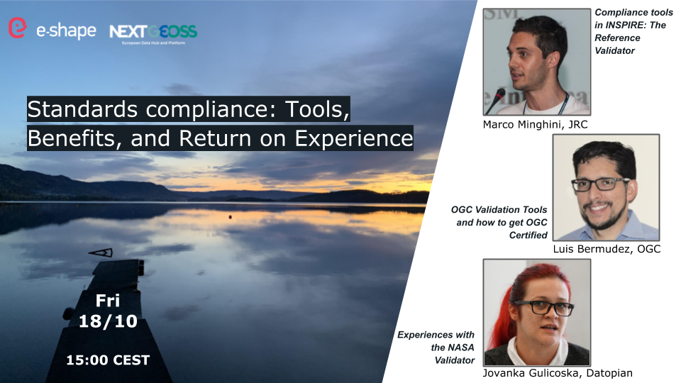

# NextGEOSS webinar _Standards compliance: Tools, Benefits, and Return on Experience_
This presentation was given at the [NextGEOSS webinar _Standards compliance: Tools, Benefits, and Return on Experience_](https://nextgeoss.eu/nextgeoss-webinar-series-standards-compliance-2019).
It can be cited as follows:

* Minghini M. (2019) Compliance tools in INSPIRE: The Reference Validator. Webinar _Standards compliance: Tools, Benefits, and Return on Experience_, October 18, 2019.

